# A new map: castle, river, and town

The original game has nine reusable maps: the five fortified towns of Derby,
Leicester, Lincoln, Nottingham, and York; Sherwood Forest; and three crossroads
maps (`Croisement01`–`03`).

It would be very nice to expand the game with a tenth map. The idea is an
entirely new castle, with a river running past it and a town spread out in
front. Gameplay needs to be considered: There should be multiple ways into the castle and routes in general, soldiers should be able to be placed and to patrol some routes, etc. The more the designer of the map knows about how the game works, the better.

## Maps in the game

These renders come from full-map screenshots (`cargo run --example render_mission_maps`).
Click one to open the full image (full-resolution AVIF, encoded with `avifenc`
using libaom at quality 60, speed 0, and YUV 4:4:4; ask me if you need lossless).

| Map | Day | Fog | Night |
| --- | --- | --- | --- |
| **Crossroads 1** (`Croisement01`) | <a href="NEW_MAP_IDEA/crossroads-1-day-full.avif">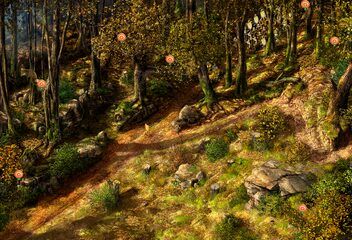</a> Tactical mission 1 | — | — |
| **Crossroads 2** (`Croisement02`) | <a href="NEW_MAP_IDEA/crossroads-2-day-full.avif">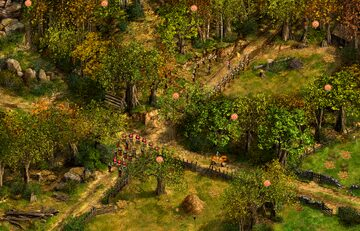</a> Tactical mission 2 | — | — |
| **Crossroads 3** (`Croisement03`) | <a href="NEW_MAP_IDEA/crossroads-3-day-full.avif">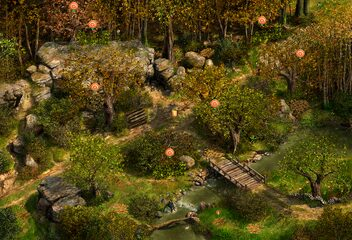</a> Tactical mission 3 | — | — |
| **Derby** | <a href="NEW_MAP_IDEA/derby-day-full.avif">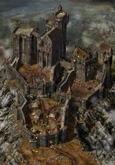</a> Attack Derby | <a href="NEW_MAP_IDEA/derby-fog-full.avif">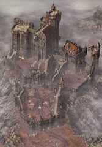</a> The Outlaw and the Prince | <a href="NEW_MAP_IDEA/derby-night-full.avif">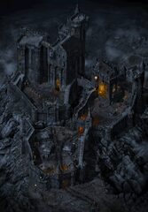</a> Save Tuck |
| **Leicester** | <a href="NEW_MAP_IDEA/leicester-day-full.avif">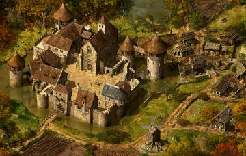</a> Contact Ranulph | — | <a href="NEW_MAP_IDEA/leicester-night-full.avif">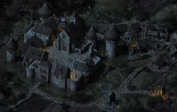</a> Save Scarlett |
| **Lincoln** | <a href="NEW_MAP_IDEA/lincoln-day-full.avif">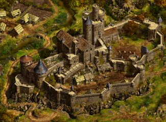</a> Robin's Godfather | <a href="NEW_MAP_IDEA/lincoln-fog-full.avif">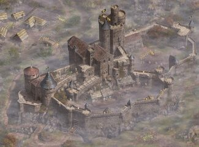</a> Attack Lincoln | <a href="NEW_MAP_IDEA/lincoln-night-full.avif">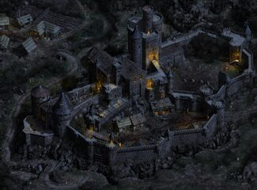</a> Free Godwin |
| **Nottingham** | <a href="NEW_MAP_IDEA/nottingham-day-full.avif">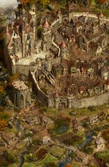</a> The Sheriff of Nottingham | <a href="NEW_MAP_IDEA/nottingham-fog-full.avif">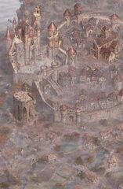</a> Free Robin | <a href="NEW_MAP_IDEA/nottingham-night-full.avif">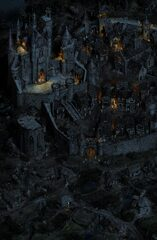</a> Contact Marian |
| **Sherwood Forest** | <a href="NEW_MAP_IDEA/sherwood-day-full.avif">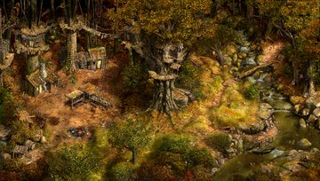</a> Sherwood Forest | — | <a href="NEW_MAP_IDEA/sherwood-night-full.avif">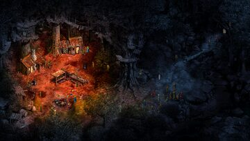</a> Sherwood Outro |
| **York** | <a href="NEW_MAP_IDEA/york-day-full.avif">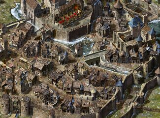</a> Save Marian | <a href="NEW_MAP_IDEA/york-fog-full.avif">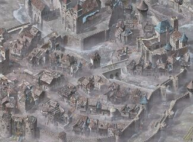</a> Attack York | <a href="NEW_MAP_IDEA/york-night-full.avif">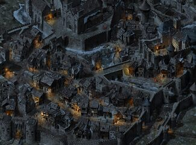</a> Lackland's Plan |

Nottingham also has a `Custom1` background used by *The Silver Arrow*; it is
outside the three standard ambience columns above.

These renders are complete mission scenes. Underneath each scene is a large,
static `.map` bitmap. Mission-specific patch sprites are drawn over it to hide
and reveal building interiors, add doors and other stateful details, and
animate elements such as trees, water, fire, and butterflies.

## Overlay examples

These loops alternate a complete mission render with its raw Day background.
Everything that appears and disappears is supplied by mission-specific entities
and overlays; both frames retain the same map framing and scale.

<table>
  <tr>
    <td> <strong>Leicester</strong> <code>Contact Ranulph.png ↔ Day/Leicester.map.png</code></td>
    <td> <strong>Tactical mission 4</strong> <code>Tactical mission 4.png ↔ Day/Croisement01.map.png</code></td>
  </tr>
</table>

The examples below are original overlay frames extracted from the retail RHS
profiles. Each animation uses a shared canvas calculated from the profile's
`center` anchor and every frame's individual `offset`; frames have not been
trimmed and independently centered. This preserves the same registration used
by the game renderer. The previews are enlarged to make the smaller mechanisms
legible, but their relative placement is unchanged.

<table>
  <tr>
    <td> <strong>Sherwood tree canopy</strong> <code>shertree.rhs: Sherwood - Arbre01</code></td>
    <td> <strong>Sherwood river</strong> <code>sherwood.rhs: Sherwood - Riviere_b1</code></td>
    <td> <strong>Crossroads 1 tree canopy</strong> <code>Treecr01.rhs: Croisement01 - Arbre01</code></td>
  </tr>
  <tr>
    <td> <strong>Derby drawbridge</strong> <code>Derpatch.rhs: Derby - Pont_levis01</code></td>
    <td> <strong>Leicester drawbridge</strong> <code>leipatch.rhs: Leicester - Pontlevis01</code></td>
    <td> <strong>Lincoln drawbridge</strong> <code>Linpatch.rhs: Lincoln - Pont_levis</code></td>
  </tr>
  <tr>
    <td> <strong>Nottingham portcullis</strong> <code>notpatch.rhs: Nottingham - herse</code></td>
    <td> <strong>York portcullis</strong> <code>Yorkpatch.rhs: York - herse</code></td>
    <td> <strong>Leicester windmill</strong> <code>Leifx.rhs: Leicester - moulin</code></td>
  </tr>
  <tr>
    <td> <strong>Nottingham windmill</strong> <code>notfx.rhs: Nottingham - moulin</code></td>
    <td> <strong>Crossroads 1 pit</strong> <code>Trapcr01.rhs: Croisement01 - hole</code></td>
    <td> <strong>Crossroads 1 trap</strong> <code>Trapcr01.rhs: Croisement01 - piege01e</code></td>
  </tr>
</table>

## Creation of maps

The surviving production art suggests that the original maps were drafted,
built as 3D scenes, rendered with an orthographic camera, and then painted over
in 2D. The result was exported as the static terrain bitmap.

The Leicester making-of sheet shows that progression particularly clearly:

<figure>
  <a href="NEW_MAP_IDEA/making-of-leicester.jpg">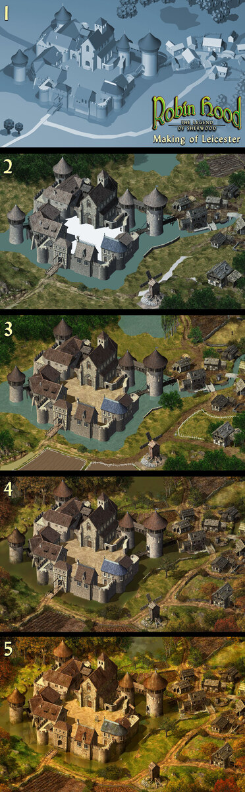</a>
  <figcaption>Leicester: 3D construction, render, and painted final map.</figcaption>
</figure>

The second production image shows Derby and is useful as an architectural
reference for the proposed castle's massing, towers, gatehouse, and defensive
layers:

<figure>
  <a href="NEW_MAP_IDEA/production-art-derby.jpg">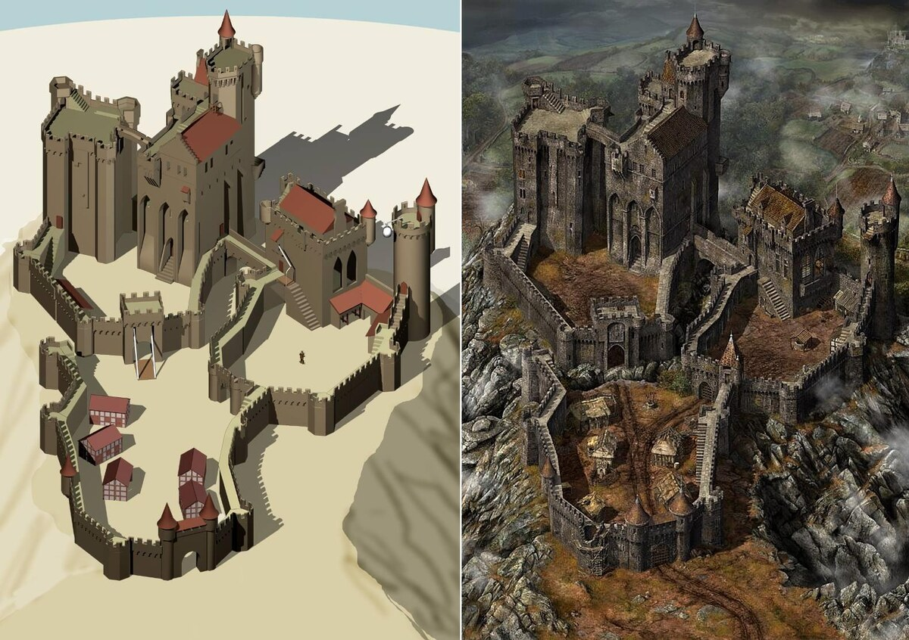</a>
  <figcaption>Original production art for Derby.</figcaption>
</figure>

In addition, each map needs walkable geometry,
height and sector data, obstacles, interactive objects, patches, and animated sprites.

<figure>
  
  <figcaption>A game map with its collision, sector, and gameplay geometry overlays visualized.</figcaption>
</figure>

The game itself includes very simplified versions of the 3D models, used to calculate some things like sound occlusion and arrow trajectories: https://www.youtube.com/watch?v=rs7UrwmwqE0

For a new map, the same pipeline is sensible: lock the gameplay layout
first, lay it out in 3D with an orthographic camera, test all routes and
elevations, render the base, paint it to match the original game's style, then author collision, sectors, patches, and ambient animation.
